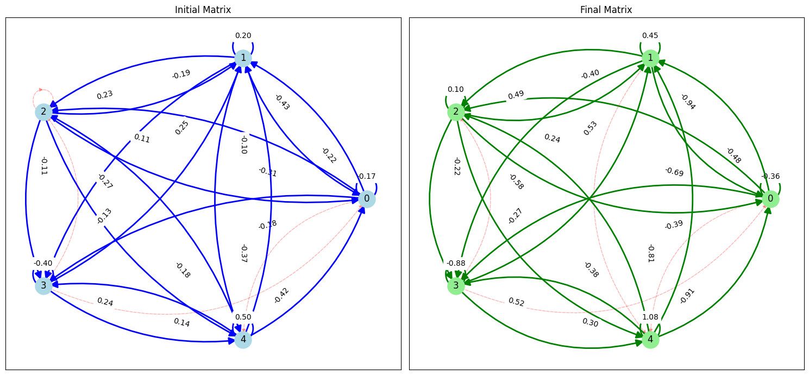
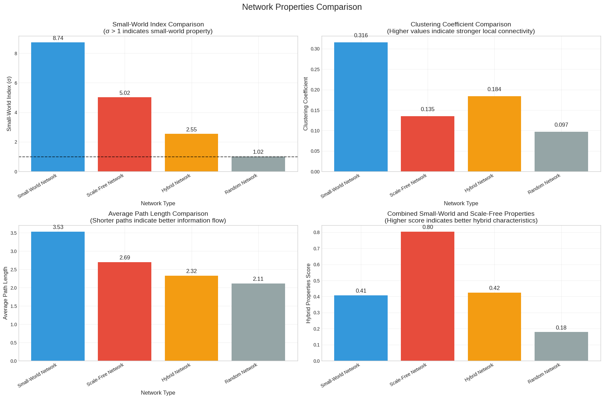

# Optimization of Echo State Networks (ESN) for Chaotic Time Series Prediction

This repository presents the research and implementation of my Master's Thesis. The project focuses on two novel optimization strategies for Echo State Networks (ESNs) to achieve high-precision chaotic time series forecasting.

---

## 🧠 Proposed Methodologies

### 1. Supervised Optimization Model
This approach utilizes an iterative refinement process where the reservoir's weight matrix is optimized through gradient-based learning.

#### **Model Architecture**
Below is the systematic architecture of the supervised ESN optimization loop:

*Key Features:*
- Gradient descent-based weight updates.
- Real-time loss calculation (NRMSE) for reservoir refinement.
- **Dynamic Sparsification:** Elimination of redundant connections as weights reach zero (see figure below).

*Left: Initial random reservoir | Right: Final optimized and sparsified reservoir.*

---

### 2. Semi-Supervised Hybrid Model
This model integrates **Complex Network Theory** with **Hyperparameter Optimization (HPO)** to design a robust hybrid reservoir.

#### **Hybrid Matrix Generation Flow**
The flowchart below illustrates the generation of a hybrid matrix by blending Small-World and Scale-Free topologies:

*Key Features:*
- **Topological Integration:** Blending Watts-Strogatz and Barabási-Albert models.
- **Structural Analysis:** Comparative study of clustering coefficients and path lengths.

*Analysis of hybrid index compared to pure Small-World, Scale-Free, and Random networks.*

---

## 📊 Performance & Experimental Results

The proposed models were evaluated using the **Mackey-Glass** and **NARMA** datasets. The results demonstrate that optimized reservoirs significantly outperform baseline ESN models.

### **Benchmarking Table**
The following table shows the NRMSE results across different network sizes (N):

*Major Achievements:*
- Superior stability in highly chaotic regimes ($\tau=29$).
- Substantial error reduction (up to several orders of magnitude) in Dataset B and C.
- Optimized edge connectivity parameters ($k$ and $m$) proved to be critical for performance.

---

## 🛠 Tech Stack
- **Frameworks:** PyTorch, NetworkX, NumPy, SciPy, Matplotlib.
- **Concepts:** Reservoir Computing, Graph Theory, Gradient Descent, Chaotic Dynamics.

## 📁 Repository Structure
- `src/`: Implementation of models and optimization algorithms.
- `docs/`: [Download Full Thesis PDF](docs/MSc_Thesis_Leila_Gonbadi.pdf).
- `results/`: Visualization files and performance logs.

## 🎓 Academic Info
- **Author:** Leila Gonbadi
- **Degree:** MSc in Computer Science - Artificial Intelligence
- **Institution:** Persian Gulf University (2025)
- **Supervisors:** Dr. Ebrahim Sahafizade, Dr. Habib Rostami
